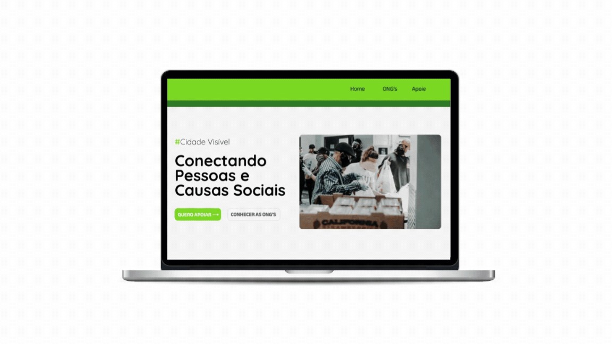

**Cidade Visível: Conectando Pessoas e Causas Sociais**  

Este é um projeto simples de uma página web desenvolvida utilizando HTML e CSS.
O objetivo deste projeto é viabilizar informações sobre organizações não governamentais existentes em uma comunidade local.

**Contribuição**  
Se você deseja contribuir com este projeto, sinta-se à vontade para abrir uma pull request ou relatar problemas no repositório.

**Licença**  
Este projeto está licenciado sob a MIT License.
